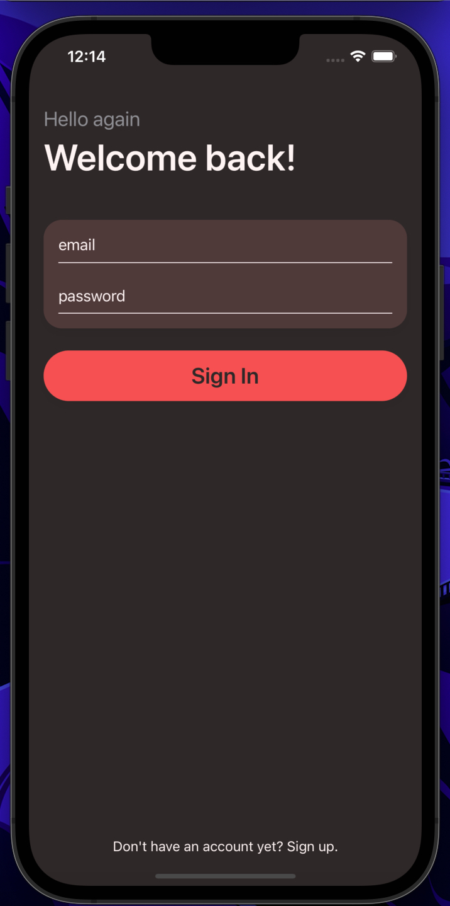
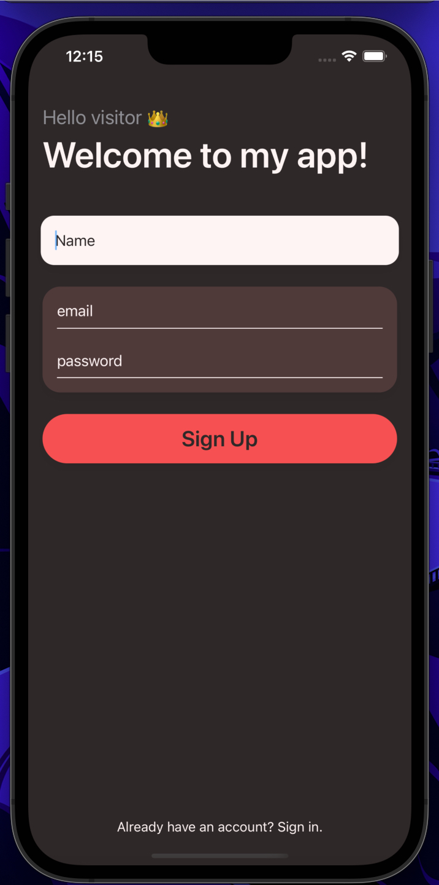
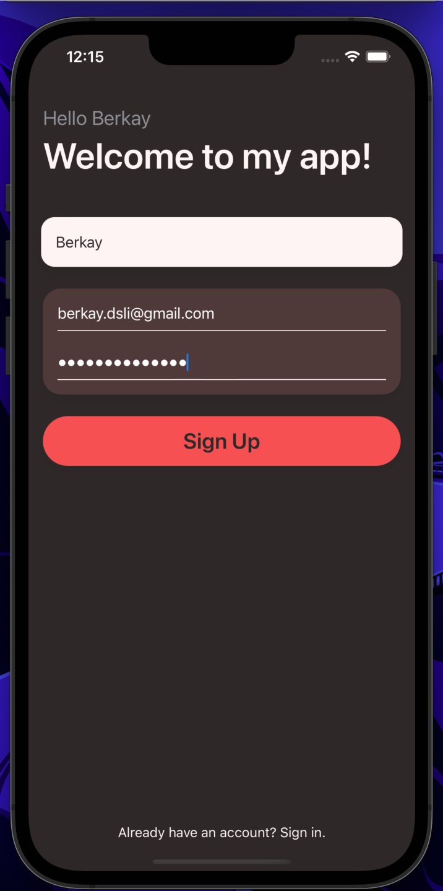

# Firebase Authentication App
Combining the power of Firebase and SwiftUI, this app demonstrates a simple authentication process.

## Architecture
- SwiftUI and MVVM
- Presentation Mode Dismiss Actions
- Animations
- TextFields and SecureFields
- Firebase **E-Mail/Password** Authentication Method

## Concept

  
  
  

 
